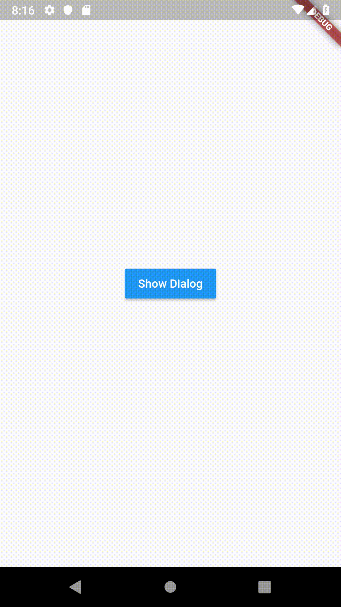

# progress_dialog

A light weight package to show progress dialog

## How to use

Import the package

```
import 'package:progress_dialog/progress_dialog.dart';
```
Create an instance of ProgressDialog
```
ProgressDialog pr;
```

Initialise the pr object inside the **build()** method passing context to it

```
pr = new ProgressDialog(context);
```

If need you can change the default message of progress dialog
```
pr.setMessage('Please wait...');
```
Showing the progress dialog
```
pr.show();
```

Dismissing the progress dialog
```
pr.hide();
```

## Demo

